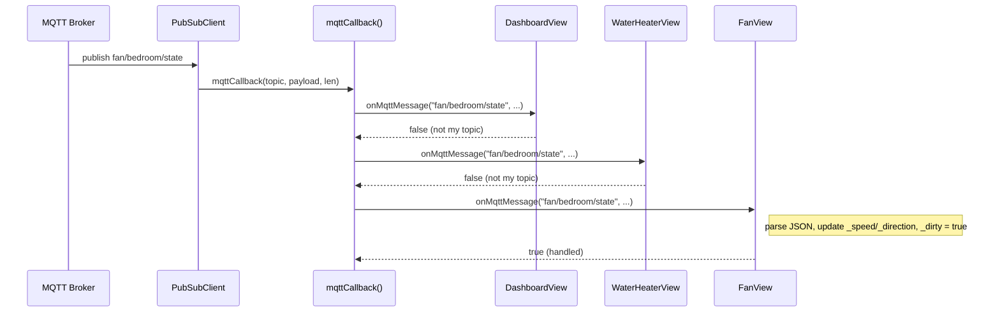
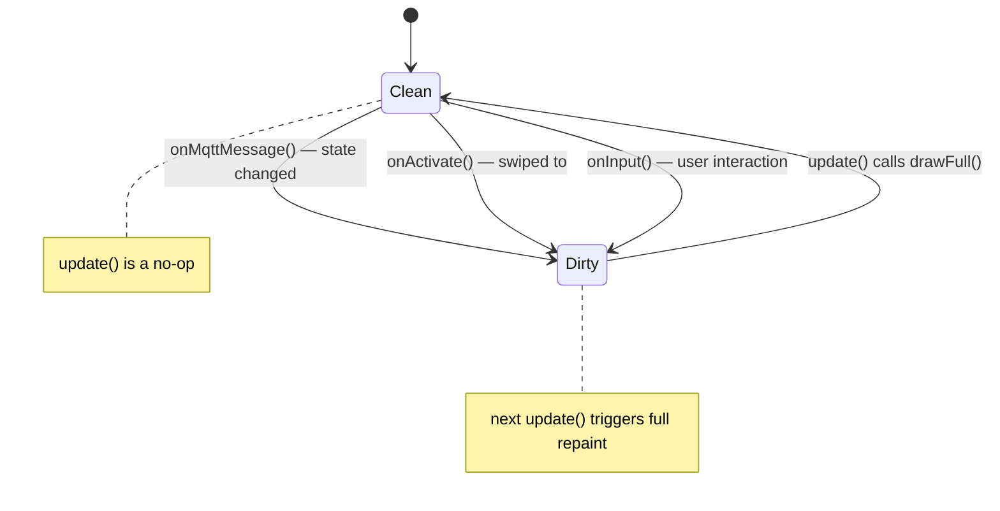
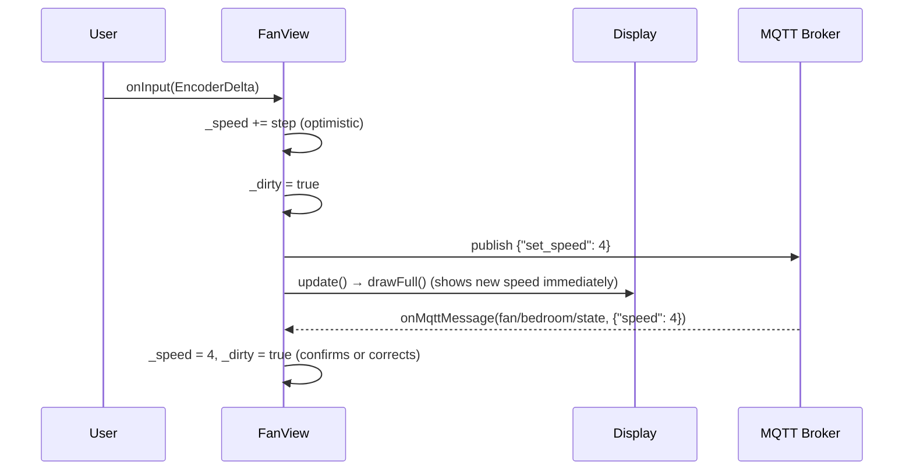
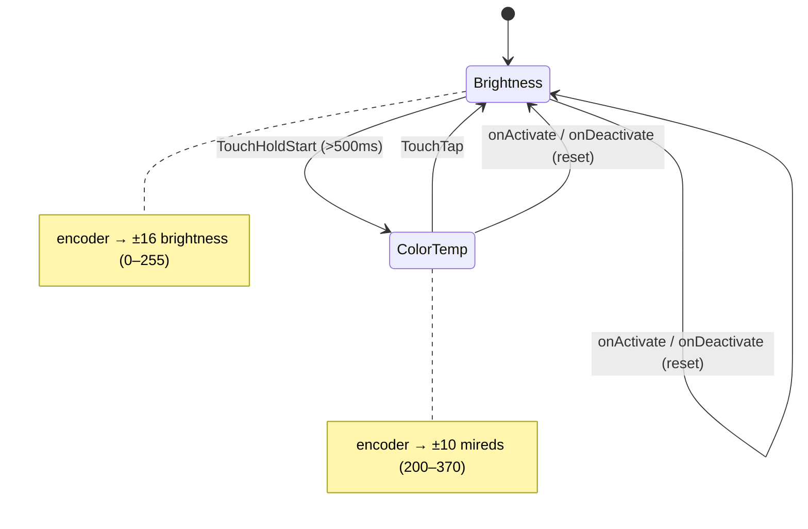
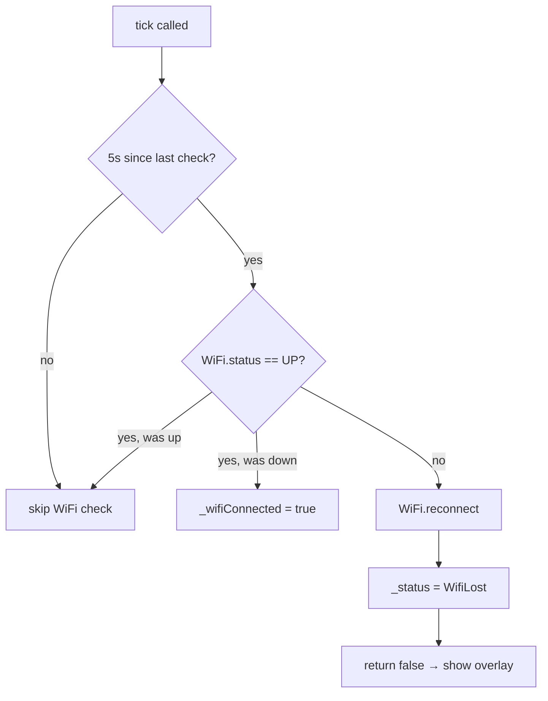
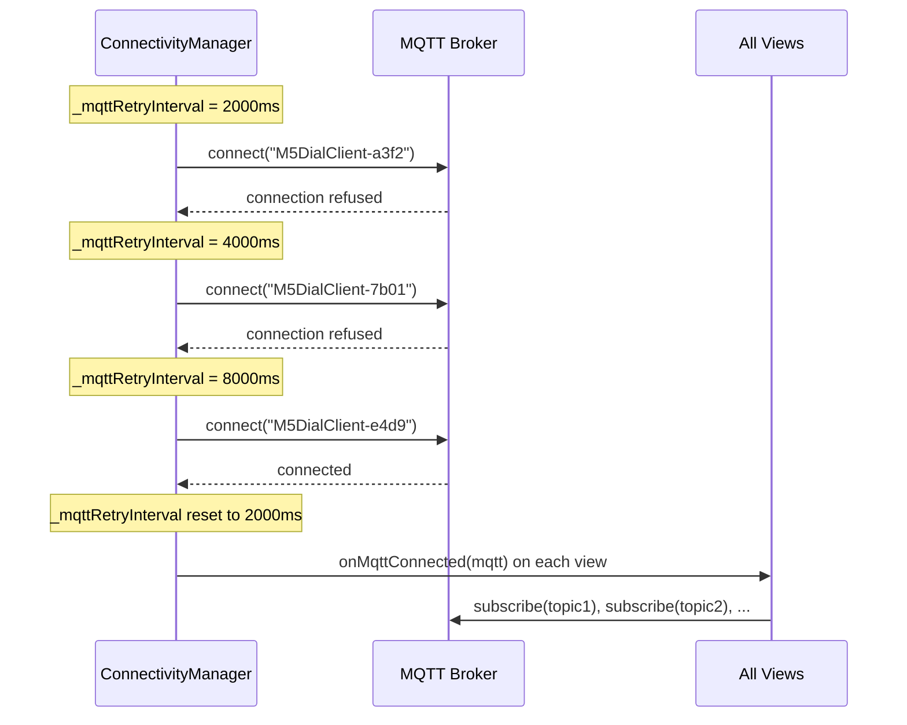
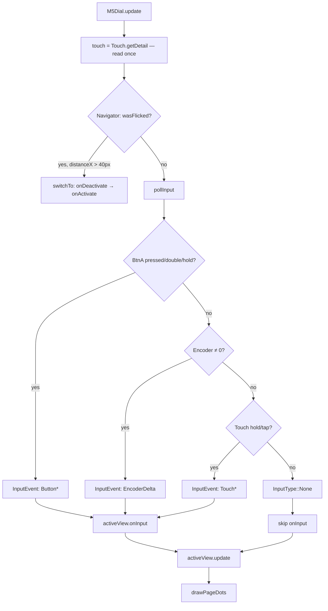

# Multi-Device Architecture for M5Stack Dial Remote

## Context

M5Stack Dial (ESP32-S3) IoT remote with a **coordinator + views** architecture. The main `.ino` runs a 5-step loop pipeline; each device screen is a `DeviceView` subclass that handles its own MQTT topics, input, and rendering. Adding a new device means implementing one subclass and registering it — zero framework changes.

SOLID principles applied pragmatically for embedded: single responsibility per class, views interchangeable through the `DeviceView` interface, views only see `PubSubClient&` and `DisplayManager&` (no god-object), and the main loop depends on the abstraction, not concrete views.

---

## File Layout

```text
m5-dial-remote/
  m5-dial-remote.ino             # Coordinator — setup() + loop()
  environment.h                  # WiFi/MQTT credentials (gitignored)
  environment.h.example          # Credential template
  src/
    Config.h                     # Compile-time constants
    InputEvent.h                 # Input event enum + struct
    DeviceView.h                 # Abstract base class
    MqttTopics.h                 # Default MQTT topics (overridable via environment.h)
    core/
      ConnectivityManager.h/.cpp # WiFi + MQTT lifecycle, exponential backoff, NTP
      DisplayManager.h/.cpp      # Display wrapper, overlays, page dots
      Navigator.h/.cpp           # Swipe detection, view switching
    gfx/
      Graphics.h/.cpp            # Drawing primitives (arcs, color wheel, arrows, speed bars)
    views/
      DashboardView.h            # Multi-device summary (stub)
      WaterHeaterView.h/.cpp     # Water heater temp + pump control
      FanView.h/.cpp             # Ceiling fan speed + direction
      LightView.h/.cpp           # Light brightness + color temp (modal encoder)
      SettingsView.h/.cpp        # Display brightness (local-only, no MQTT)
  docs/
    DESIGN.md
    IDEA.md
```

The `.ino` must remain in the project root (Arduino requirement). Source files in `src/` are compiled recursively by arduino-cli. Cross-directory includes use relative paths (e.g. `../Config.h`, `../core/DisplayManager.h`).

---

## Architecture Overview

```text
┌─────────────────────────────────────────────────┐
│  loop()  — 5-step pipeline                       │
│                                                   │
│  1. connectivity.tick()        → WiFi/MQTT health │
│  2. touch = getDetail()        → read once        │
│  3. navigator.processTouchInput() → consume swipes│
│  4. pollInput()                → produce InputEvent│
│     activeView->onInput()      → view handles it  │
│     activeView->update()       → view renders     │
│  5. displayMgr.drawPageDots()  → navigation dots  │
└─────────────────────────────────────────────────┘
         │                    │
         ▼                    ▼
  ConnectivityManager    Navigator
  (WiFi + MQTT + NTP)   (swipe + view index)
         │
         ▼
  mqttCallback() ──► iterates ALL views ──► view.onMqttMessage()
```

---

## Key Interfaces

### DeviceView (abstract base — `DeviceView.h`)

```cpp
class DeviceView {
public:
  virtual ~DeviceView() = default;

  virtual const char* name() const = 0;

  // MQTT — called on ALL views (not just active)
  virtual void onMqttConnected(PubSubClient& mqtt) = 0;  // subscribe to topics
  virtual bool onMqttMessage(const char* topic,           // return true if handled
                             const uint8_t* payload, unsigned int len) = 0;

  // Lifecycle
  virtual void onActivate(DisplayManager& display) = 0;   // swiped-to; full redraw
  virtual void onDeactivate() = 0;                         // swiped-away

  // Input — called only on active view
  virtual void onInput(const InputEvent& event, PubSubClient& mqtt) = 0;

  // Rendering — called every loop iteration on active view
  virtual void update(unsigned long now, DisplayManager& display) = 0;
};
```

**Design decisions:**
- `onMqttMessage` called on ALL views so background views track state. When you swipe to a view, it already has current data.
- `onInput` and `update` only called on active view — inactive views consume zero CPU.
- Views receive `PubSubClient&` directly to publish. No intermediary — pragmatic, not over-abstracted.

### InputEvent (`InputEvent.h`)

```cpp
enum class InputType : uint8_t {
  None, ButtonPress, ButtonDoubleClick, ButtonHold,
  EncoderDelta, TouchTap, TouchHoldStart, TouchHoldEnd
};

struct InputEvent {
  InputType type = InputType::None;
  int16_t   delta = 0;    // encoder ticks
};
```

Swipe events are **not** in this enum — Navigator consumes them before input dispatch.

### MqttTopics (`MqttTopics.h`)

Default topic strings defined as `#define` macros with `#ifndef` guards. Override any topic in `environment.h` before including this header.

---

## Subsystem Details

### Config.h — Centralized Constants

All magic numbers live here: display geometry, arc parameters, timing intervals, dot layout.

```cpp
namespace Cfg {
  constexpr int DISPLAY_CX = 120, DISPLAY_CY = 120;

  constexpr int   ARC_RADIUS    = 100;
  constexpr int   ARC_THICKNESS = 10;
  constexpr int   ARC_START_DEG = 135;     // 7 o'clock
  constexpr int   ARC_SPAN_DEG  = 270;
  constexpr float TEMP_MIN_F    = 90.0f;
  constexpr float TEMP_MAX_F    = 140.0f;

  constexpr int CW_INNER_RADIUS  = 83;
  constexpr int CW_OUTER_RADIUS  = 87;
  constexpr int CW_STEP_DEG      = 10;
  constexpr int CW_ADVANCE_DEG   = 8;

  constexpr unsigned long FRAME_INTERVAL_MS      = 50;     // ~20 fps
  constexpr unsigned long WIFI_CHECK_INTERVAL_MS = 5000;
  constexpr unsigned long MQTT_RETRY_MIN_MS      = 2000;
  constexpr unsigned long MQTT_RETRY_MAX_MS      = 30000;

  constexpr int SWIPE_THRESHOLD_PX = 40;
  constexpr int MAX_VIEWS          = 8;

  constexpr int DOT_RADIUS_PX  = 4;
  constexpr int DOT_Y_OFFSET   = 220;
  constexpr int DOT_SPACING_PX = 14;
}
```

### ConnectivityManager — WiFi + MQTT + NTP

Owns `WiFiClient` + `PubSubClient`. Manages WiFi reconnect, MQTT exponential backoff (2s → 30s cap), and NTP time sync.

- `beginBlocking(ssid, pass, broker, port, gmtOffset, dstOffset)` — called once in `setup()`, blocks until WiFi connects, configures NTP
- `tick(now)` — non-blocking; returns `true` if MQTT is connected. Calls `mqtt.loop()` internally.
- `status()` / `statusMessage()` — for overlay display when disconnected
- `mqtt()` — returns `PubSubClient&` for views to publish through
- `setViews(views, count)` — on MQTT reconnect, iterates all views calling `onMqttConnected()` so each re-subscribes

### DisplayManager — Shared Display Resource

Thin wrapper. Views get direct `M5GFX&` access for custom rendering.

- `begin()` — set default font, datum, text color
- `clear()` — clear display
- `gfx()` — returns `M5GFX&` for direct drawing (arcs, custom graphics)
- `drawCenteredText(text, color, size)` — convenience
- `drawPageDots(current, total)` — iOS-style navigation dots at bottom
- `drawStatusOverlay(message)` — full-screen status (WiFi/MQTT disconnected)

### Graphics — Reusable Drawing Primitives (`Graphics.h/.cpp`)

- `Gfx::drawValueArc(gfx, value, color, cx, cy, r, thickness, startDeg=135, spanDeg=270)` — gauge arc, 0.0–1.0
- `Gfx::drawColorWheel(gfx, angleOffset, cx, cy, rInner, rOuter)` — spinning rainbow ring
- `Gfx::hsvToRgb565(hue, sat, val)` — color conversion
- `Gfx::drawArrow(gfx, cx, cy, up, color)` — directional arrow (fan view)
- `Gfx::drawSpeedBars(gfx, speed, dirForward, cx, cy, barW, barH, gap)` — 6-bar speed indicator
- `Gfx::drawPageDots(gfx, current, total, cy, dotRadius, spacing)` — dot indicators

### Navigator — Swipe Detection + View Switching

- `processTouchInput(touch, display)` — takes pre-read `m5::touch_detail_t` and `DisplayManager&`; detects flick gestures, calls `switchTo()` on swipe
- `switchTo(index, display)` — calls `onDeactivate()` on old view, `onActivate()` on new view
- `goTo(index, display)` — programmatic navigation (same as `switchTo`)
- `activeView()` / `activeIndex()` / `viewCount()` — accessors

### MQTT Routing

PubSubClient requires a C-style callback. The routing is a free function in the `.ino`:

```cpp
void mqttCallback(char* topic, byte* payload, unsigned int length) {
  payload[length] = '\0';
  for (uint8_t i = 0; i < VIEW_COUNT; i++) {
    if (views[i]->onMqttMessage(topic, payload, length)) break;
  }
}
```

Each view does `strcmp()` on its own topics and returns `true` if handled. Linear scan is fine for <10 views.

---

## Concrete Views

### DashboardView

| Aspect | Detail |
| --- | --- |
| Sub topics | `water/temp`, `water/recirc`, `fan/bedroom/state` |
| Pub topic | `fan/bedroom/command`, `water/recirc/cmd` |
| State | Aggregated from other views |
| Display | Multi-device summary (stub — header only, no `.cpp`) |

### WaterHeaterView

| Aspect | Detail |
| --- | --- |
| Sub topics | `water/temp`, `water/recirc` |
| Pub topic | `water/recirc/cmd` |
| State | `_tempF`, `_pumpRunning`, `_wheelAngle`, `_lastFrameTime` |
| Button | Publish `{"start": 5}` to `water/recirc/cmd` |
| Encoder | Unused |
| Display | Temp text (center), value arc (90–140°F with color bands), color wheel when pump on |
| Animation | Color wheel at 20fps, draws over itself without clearing |
| Dirty flag | `_dirty` set by `onMqttMessage` and `onActivate`, cleared after `drawFull()` |

### FanView

| Aspect | Detail |
| --- | --- |
| Sub topics | `fan/bedroom/state` |
| Pub topic | `fan/bedroom/command` |
| State | `_speed` (0–6), `_direction` ("forward"/"reverse") |
| Button | Toggle fan on/off |
| Encoder | Cycle speed 0–6 |
| ButtonHold | Toggle direction |
| Display | Speed arc (0–6 mapped to gauge), direction arrow (up/down) |

Note: Hubspace "forward" = downdraft. The UI inverts this — up arrow = "reverse" (updraft).

### LightView — Modal Encoder

| Aspect | Detail |
| --- | --- |
| Sub topics | `fan/bedroom/light` |
| Pub topic | `light/bedroom/command` |
| State | `_on`, `_brightness` (0–255), `_colorTemp` (200–370 mireds), `_mode` enum |
| Button | Toggle on/off |
| Encoder (Brightness mode) | Adjust brightness (step 16, min 1) |
| Encoder (ColorTemp mode) | Adjust color temperature (step 10 mireds) |
| Touch hold (>500ms) | Enter color temp mode (sticky) |
| Touch tap | Exit color temp mode back to brightness |
| Display (off) | Grey light bulb icon + "OFF" label |
| Display (on, brightness) | Yellow light bulb icon + brightness %, brightness arc, "BRIGHTNESS" label |
| Display (on, color temp) | Yellow light bulb icon + mireds value, color temp arc, "COLOR TEMP" label |

### SettingsView — Local Device Settings

| Aspect | Detail |
| --- | --- |
| Sub topics | None |
| Pub topic | None |
| State | `_brightness` (0–255) |
| Encoder | Adjust display brightness |
| Button | Unused |
| Display | "Settings" header, brightness percentage, value arc (WHITE) |
| MQTT | No-op — all settings are local to the device |

---

## Main .ino Coordinator

The `.ino` is the coordinator — it owns static view instances, wires subsystems in `setup()`, and runs the 5-step pipeline in `loop()`. Touch state is read once per loop and shared between Navigator (swipes) and `pollInput()` (hold/tap). Touch hold uses custom duration-based detection (500ms threshold) because M5Unified's built-in hold state machine requires perfectly still contact.

View order: Dashboard → Water Heater → Fan → Light → Settings

---

## Design Constraints

- **No heap allocation in hot path** — all views statically allocated, `StaticJsonDocument` on stack
- **No STL containers** — fixed C arrays for view list
- **One vtable lookup per loop** — negligible at 240 MHz
- **Arduino IDE compatible** — `.ino` in project root, `src/` compiled recursively
- **C++17** — `constexpr`, `enum class`, `auto`, but no exceptions or RTTI

---

## Design Patterns

### Observer — MQTT Fan-Out

The MQTT broker acts as an external event source. `mqttCallback()` broadcasts each message to all views in registration order; the first view that recognizes the topic returns `true` and stops the scan. Background views update their internal state even when not displayed, so swiping to a view shows current data immediately.



On MQTT reconnect, `ConnectivityManager` calls `onMqttConnected()` on every view so each re-subscribes to its topics. Subscriptions are always active for all views, not just the active one.

### Dirty Flag — Lazy Rendering

Views track a `bool _dirty` flag. `update()` is called every `loop()` iteration on the active view but only repaints when `_dirty` is true. This avoids redundant full-screen redraws at 240 MHz loop speed.



`_dirty` is set by three sources: incoming MQTT state, view activation (swipe-to), and local input. Background (inactive) views accumulate dirty state from MQTT messages but never draw — `update()` is only called on the active view. On activation, `onActivate()` sets `_dirty = true` unconditionally, guaranteeing a clean repaint.

**WaterHeaterView exception:** Has a second rendering track — the color wheel animation runs at ~20 fps independent of the dirty flag, drawing over itself without clearing.

### Optimistic Update

Views that publish commands update local state immediately without waiting for the MQTT echo. The display reflects the change on the next `update()` call. When the broker eventually echoes the authoritative state back via `onMqttMessage()`, the view overwrites its local state and sets `_dirty = true` again — self-correcting any drift.



LightView additionally rate-limits publishes to one per 150 ms during fast encoder spin. The display always updates immediately; only the MQTT publish is throttled.

### Modal Encoder — LightView

LightView uses a two-mode encoder where the physical encoder controls different parameters depending on the current mode. Mode is sticky — entering color temp mode requires a deliberate touch hold, and exiting requires a tap.



`TouchHoldEnd` is intentionally ignored — mode persists after releasing. This prevents accidental mode exit from hand tremor during a hold gesture. The encoder is ignored entirely when the light is off.

---

## Connectivity Resilience

`ConnectivityManager::tick()` runs every `loop()` iteration. It manages WiFi and MQTT as two independent recovery tracks. When either is down, `tick()` returns `false` and the coordinator freezes the UI with a status overlay — no input dispatch, no rendering.

### WiFi Recovery

WiFi is polled every 5 seconds (`WIFI_CHECK_INTERVAL_MS`). On disconnect, `WiFi.reconnect()` is called immediately with no backoff — the ESP32 SDK handles this non-blockingly.



### MQTT Recovery — Exponential Backoff

MQTT reconnect uses exponential backoff starting at 2 s, doubling on each failure, capped at 30 s. On success, the interval resets and all views re-subscribe.



Each reconnect attempt uses a random client ID (`"M5DialClient-" + hex(random(0xffff))`) to avoid broker-side session conflicts after a dirty disconnect.

| Attempt | Wait before retry |
| --- | --- |
| 1 | 2 s |
| 2 | 4 s |
| 3 | 8 s |
| 4 | 16 s |
| 5+ | 30 s (capped) |

### No Hardware Watchdog

There is no `esp_task_wdt` configuration. If the main loop hangs (e.g., blocking I2C inside `M5Dial.update()`), recovery requires a power cycle.

---

## Input Dispatch Chain

Touch state is read exactly once per loop and shared by reference. This preserves one-shot flags (`wasFlicked()`, `wasClicked()`) that would be consumed on a second read.



**Swipe isolation:** `InputType` has no swipe variant. Navigator consumes flick gestures before `pollInput()` runs, and `pollInput()` never checks `wasFlicked()`. Swipes cannot reach views — enforced at the type level.

**Button/touch mutual exclusion:** All touch logic in `pollInput()` is guarded by `!BtnA.isPressed()`. Pressing the physical button contacts the capacitive screen; the guard prevents phantom touch events.

**Touch hold detection:** M5Unified's built-in hold requires perfectly still contact, which is impractical on the small screen. The coordinator uses its own time-based detection: track `isPressed()` duration against a 500 ms threshold, fire `TouchHoldStart` when exceeded, fire `TouchHoldEnd` on release. The 4-count encoder accumulator (`_encoderAccum / 4`) in views smooths sub-detent noise so one physical click produces exactly one step.
